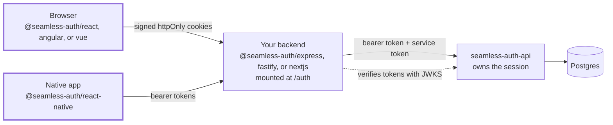

# Seamless Auth client SDKs

This repository is an npm workspace that publishes the client-side packages for
[Seamless Auth](https://github.com/fells-code/seamless-auth-api):

| Package                                                          | What it is                                                                                                                                  |
| ---------------------------------------------------------------- | ------------------------------------------------------------------------------------------------------------------------------------------- |
| [`@seamless-auth/client`](packages/client/README.md)             | Framework-agnostic core: the headless auth client, session store, result and error types.                                                   |
| [`@seamless-auth/react`](packages/react/README.md)               | React binding: `AuthProvider`, hooks, and optional prebuilt auth screens. Depends on the client package.                                    |
| [`@seamless-auth/react-native`](packages/react-native/README.md) | Headless React Native binding: provider, hooks, and the native ports for passkeys, keystore token storage, and in-app browser OAuth.        |
| [`@seamless-auth/angular`](packages/angular/README.md)           | Angular binding: a signal-based `SeamlessAuth` service, route guards, an `HttpClient` interceptor, and optional standalone sign-in screens. |

Most React applications only install `@seamless-auth/react`; it brings the client
core with it. The client package exists so that the bindings share one
implementation of the auth flows and session state instead of re-implementing
them; `@seamless-auth/react-native`, `@seamless-auth/angular` and
`@seamless-auth/vue` are bindings over it too, and so will the Svelte binding be.

## Start here

New to Seamless Auth? The [self-hosted quickstart](https://docs.seamlessauth.com/start/quickstart/) runs the full stack locally with Docker. If Seamless hosts your auth instance, follow the [managed quickstart](https://docs.seamlessauth.com/start/managed-quickstart/) instead.

This repo is the client layer: the browser and native SDKs, which talk only to your backend's `/auth` routes and never to the auth API directly.



[How the pieces connect](https://docs.seamlessauth.com/start/overview/#how-the-pieces-connect) explains each hop. [Compatibility matrix](https://docs.seamlessauth.com/build/ecosystem/#compatibility-matrix) lists which package versions work together.

## Working in this repository

```bash
npm install
npm run lint
npm test
npm run build
```

Tests run as one Jest project per package from the root. The React, React
Native, Angular and Vue projects resolve `@seamless-auth/client` to the client
package's source, so a change in
the core is exercised by the React suite without a build in between. Releases
are managed with Changesets; see [RELEASES.md](RELEASES.md) and
[CONTRIBUTING.md](CONTRIBUTING.md).

## License

Apache-2.0. See [LICENSE](LICENSE).
